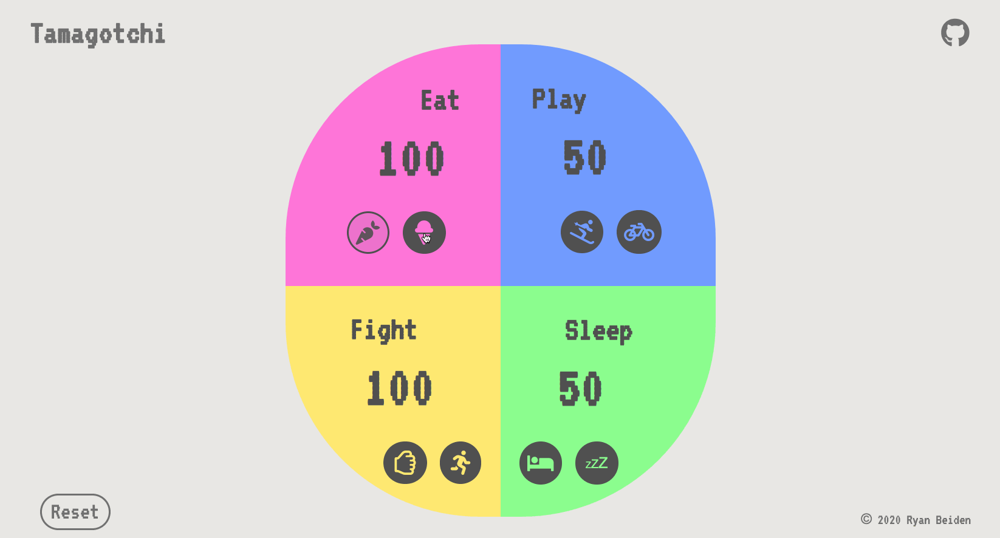

# Tamagotchi

This project is a Tamagotchi. You have four sections that each have two buttons that do different things. Each button either adds or decreases points. There is a Reset button to bring you back to the default points without having to refresh your page. The goal of this project was to experiment with SASS mixins, variables, and media breakpoints. The JavaScript is simple, the SASS is a little more intricate.

There is also a branch that allows you to properly view the project's responsiveness. When you get to a tablet size, the sections break off and stack on top of each other with the Reset button moving to the top.

P.S. There's a surprise when you hover over the Tamagotchi title.

## Preview Project

## Preview Responsive Format

## View Project
- Clone the repository 👉🏼 `https://github.com/RyanBeiden/tamagotchi.git`

## View Responsive Format
- Clone the repository 👉🏼 `https://github.com/RyanBeiden/tamagotchi.git`

- Run `git checkout rb-responsive`

## Technologies Used
 

#### Backlog/Roadmap

- Build a progress bar displaying the average HP of all four quadrants
